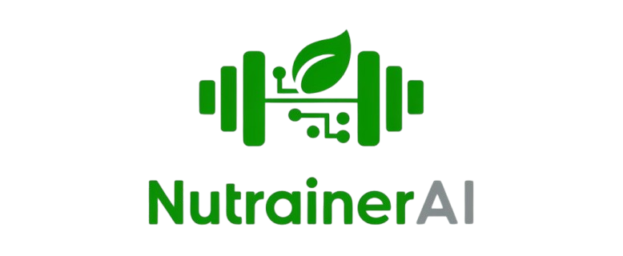
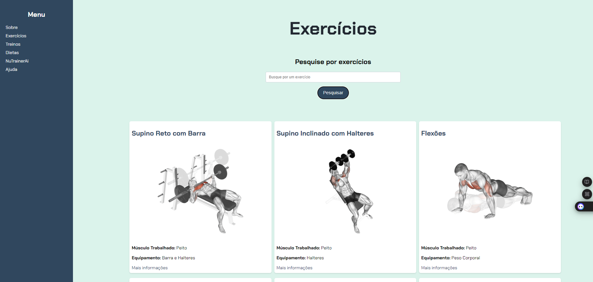
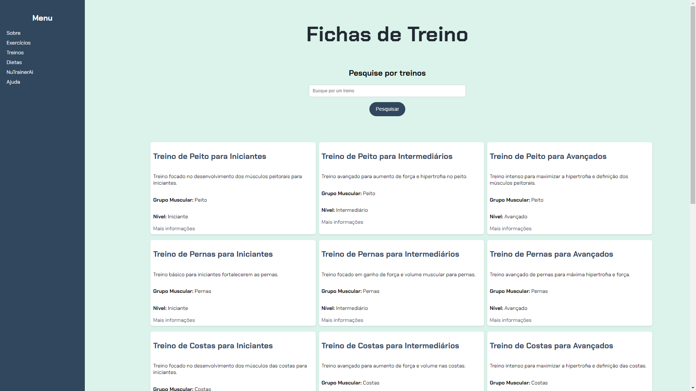
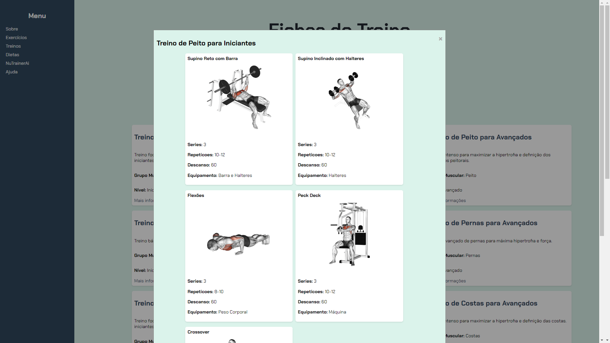
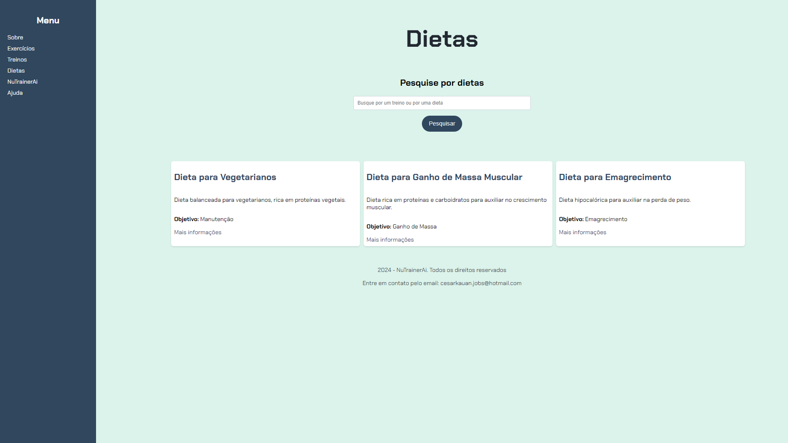
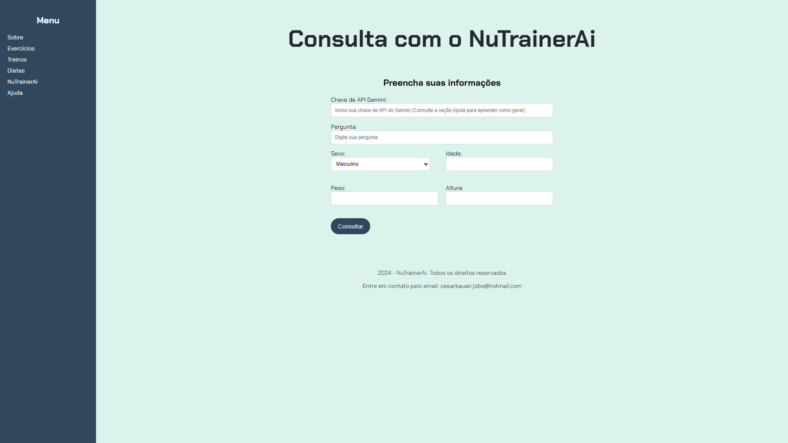

# NuTrainAI

O **NuTrainAI** é um sistema inovador que busca auxiliar os usuários no mundo fitness, oferecendo uma lista de exercícios com animações de execução, fichas de treino categorizadas por níveis e sugestões de dietas personalizadas de acordo com os objetivos do usuário. Um dos principais diferenciais do NuTrainAI é a integração com a inteligência do Gemini da Google, permitindo consultorias personalizadas e respostas a dúvidas com base nas características individuais, como sexo, idade, peso e altura.

Disponivel em: https://cesarka1.github.io/NuTrainerAI/

## Tecnologias Utilizadas

  
  
  
  

## Características e Funcionalidades
**Interações e Interfaces:**
- **Lista de Exercícios:** Acesso a uma variedade de exercícios com animações que demonstram a execução correta.

- **Fichas de Treino:** Fichas de treino organizadas por níveis de dificuldade.

- **Sugestões de Dieta:** Planos de dieta adaptados aos objetivos do usuário.

## Implementação futura Pós Imerssão
- **Consultoria Personalizada:** Interação com a inteligência do Gemini para tirar dúvidas e oferecer recomendações personalizadas.(Ainda não está funcionado)

## Motivação
A escolha deste tema surgiu do meu amor pelo esporte, especialmente pela musculação, e pela importância de cuidar da saúde alimentar. Com o NuTrainAI, desejo incentivar outras pessoas a se envolverem com o esporte, especialmente aquelas que podem hesitar em começar por acharem difícil ou terem vergonha de não saberem executar os exercícios corretamente.

## Processo de Desenvolvimento

O desenvolvimento do **NuTrainAI** começou com o objetivo de aprimorar minhas habilidades em front-end, que estavam enferrujadas e nunca foram meu forte. Durante essa jornada, enfrentei diversos desafios, especialmente em relação à estilização das páginas. Questões como alinhamento de elementos, tamanhos excessivos de objetos e outros detalhes de design se tornaram obstáculos frequentes. No entanto, com o auxílio das aulas da Imersão da Alura e o uso do Gemini como ferramenta de consulta, consegui superar essas dificuldades e aprender de forma prática.

Após a fase inicial, quando a ideia começou a ganhar forma e a primeira tela estava sendo criada, essa sendo uma que agrupava treinos e dietas, percebi que poderia ir além. Decidi mergulhar de cabeça no projeto e me desafiar ainda mais. Assim, optei por dividir a interface em três telas: uma para todos os exercícios, outra para as fichas de treino que utilizavam a lista de exercícios já criada, e uma terceira seção dedicada às dietas.

Felizmente, após muitas horas ajustando CSS, HTML e adicionando uma pitada de JavaScript para garantir que tudo funcionasse corretamente, consegui implementar essa estrutura com sucesso.

No entanto, ao chegar a esse ponto, refleti: "Se este é um sistema de consulta de treinos, exercícios e dietas, ninguém vai acessá-lo com frequência pelo PC." 🤔 Foi então que percebi a necessidade de desenvolver uma interface responsiva. Iniciei uma intensa jornada, ao ponto de precisar virar a noite (não façam isso crianças, isso não é saudavel kkkkk) , para garantir que o site fosse eficiente e adaptável a dispositivos móveis, permitindo consultas rápidas de exercícios e visualizações das execuções em qualquer lugar.

Chegou ao ponto de eu estar tão imerso no projeto que como dizem no meio fitnes eu fui até a falha, mas nesse caso do meu notebook, que enquanto eu codava e tava com mil abas abertas, falhou e deu tela azul KKKKKKKK 😅

## Contribua
1. Clone o repositório.
2. Crie uma branch para sua feature.
3. Faça alterações.
4. Envie um pull request.

Agradeço seu apoio ao NuTrainAI. Juntos, podemos promover um estilo de vida saudável!

### Autor e Links

  
  

### Galeria

